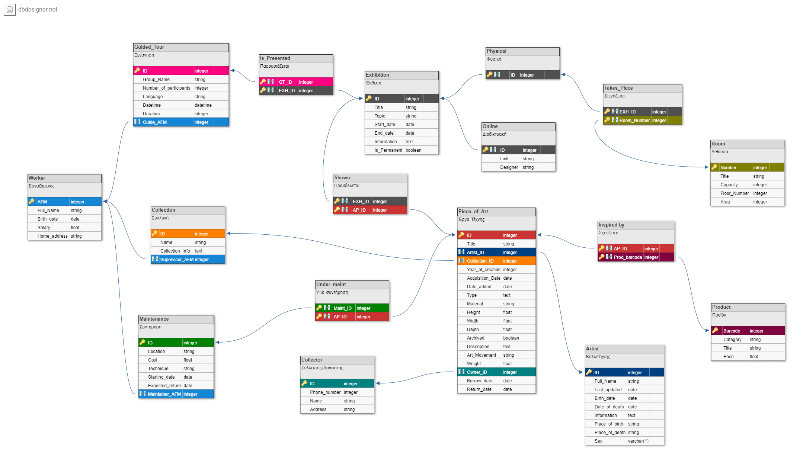

# Περιγραφή του Project

**Μπορείτε να κατεβάσετε όλα τα περιεχόμενα σε αρχείο .zip από [εδώ](https://github.com/sitistas/art-gallery-ECE_CK703-team18/archive/refs/heads/main.zip).**

Η εφαρμογή πινακοθήκης αναπτύχθηκε στα πλαίσια του μαθήματος "Βάσεις Δεδομένων".

Δημιουργοί:

- Σιτήστας Κωνσταντίνος Κυριάκος, Α.Μ.: 1066577
- Χαλαντζούκας Φοίβος, Α.Μ.: 1066579

## Περιεχόμενα:
- [ERD διάγραμμα](Gallery_img.png)
- [Λογικό σχεσιακό διάγραμμα](DB_Schema.png)
- [Αρχείο για την δημιουργία της βάσης δεδομένων](art-gallery.db.sql)
- [Αρχείο βάσης δεδομένων](art-gallery.db)
- [Κώδικας εφαρμογής σε Python](art-gallery.py)
- [Εκτελέσιμο .exe αρχείο](art-gallery.exe)
- [Σύντομη Παρουσίαση](Εφαρμογή%20Πινακοθήκης.pptx)
- [Αναφορά](Report.pdf)

***Προσοχή: Το εκτελέσιμο αρχείο (.py ή .exe) πρέπει να βρίσκεται στον ίδιο φάκελο με το .db αρχείο για να λειτουργεί σωστά η εφαρμογή!***

## Α' Φάση: Δημιουργία του εννοιολογικού μοντέλου της βάσης δεδομένων και του αντίστοιχου λογικού σχεσιακού διαγράμματος

Στην παρακάτω εικόνα μπορείτε να δείτε το εννοιολογικό μοντέλο που αναπτύχθηκε για την εφαρμογή μας:

 

Μετά την ολοκλήρωση του ERD μοντέλου, το μετασχηματίσαμε στο αντίστοιχο λογικό μοντέλο (schema) το οποίο φαίνεται στην παρακάτω εικόνα:

## Β' Φάση: Υλοποίηση της βάσης δεδομένων και queries SQL

- [Αρχείο για την δημιουργία της βάσης δεδομένων](art-gallery.db.sql)
- [Αρχείο βάσης δεδομένων](art-gallery.db)

## Γ' Φάση: Δημιουργία εφαρμογής για αλληλλεπίδραση με την βάση σε Python

- [Κώδικας εφαρμογής σε Python](art-gallery.py)
- [Εκτελέσιμο .exe αρχείο](art-gallery.exe) (δημιουργήθηκε με χρήση του πακέτου pyinstaller)
